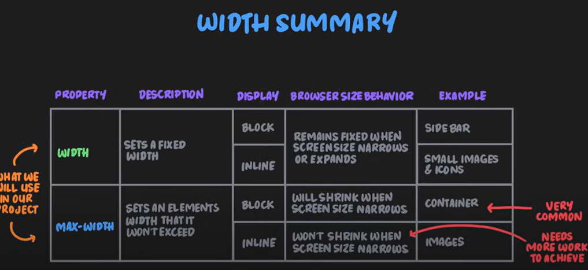
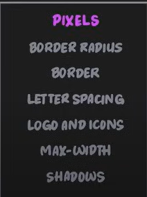

# CSS TOPICS
## Introduction to CSS
CSS is a stylesheet language used to control the layout and appearance of the web page.

Block Level Elements - Takes up entire line (width) of the page. Eg: `
, <h1, h2>, 
 etc`.

Inline Elements - Takes up only the space needed (width) of the content. Eg. `, <a>,  etc`.

CSS Properties - 3 major types.

1. Content - CSS changes inside the box (text). Eg: `color, font-size, font-family etc`.
2. Box - CSS changes to the box itself. Eg: `width, height, border, padding etc`.
3. Layout - CSS changes to the layout of the box. Eg: `position, float, flex, grid`.

CSS Rules - Grouping of one or more CSS properties which are to be applied to one or more HTML elements. Eg: `h1 { color: blue; }`.

CSS Declaration - Combination of a CSS property and its value. Eg: `color: blue;`.

## CSS TEXT
### Text Styling
Styling focused on text, spacing of text, size changes for text, color and style guide.

Some examples - `text-transform: uppercase; `, `text-align: center;`, `font-size: 20px;`

### Text Spacing
Spacing between lines of text, spacing of text within a line, spacing between words.

Some examples - `line-height: 1.5;`, `letter-spacing: 2px;`, `text-align: center`

`text-align` property only works for block elements as inline elements cannot move as there is no space.

### CSS Color
Color of text, background color, color of borders.

Some examples - ` color: blue;`, `background-color: red;`, `border-color: green;`. Can have Hex or RGB values (commonly used)

Have few color palettes with tints and shades of the color (usually primary and secondary palette)

## CSS Selectors
CSS selectors are used to select the HTML elements you want to apply CSS styles to.

Some types of Selectors: Basic selectors ( tag, id, class), Combinators (descendant, child, adjacent sibling), Pseudo-classes (link, hover, active), Pseudo-elements (first letter, first line, before, after)

Styles declared later takes priority over the styles declared earlier.

Stylesheets also follow the same pattern.

### Class and ID Selectors
Class selectors are used to select elements with a specific class. Eg: `.class-name { color: blue; }`

ID selectors are used to select elements with a specific id. Eg: `#id-name { color : blue; }`

### Pseudo-classes
Pseudo-classes are used to select elements based on their state. Eg: `:hover { color: blue; }`. Other examples are `:link`, `:visited`, `:active`

Good practice is to style the pseudo-classes for the anchor tags, not the anchor tag itself. Eg. `a { color: blue; }` - not a good practice.

### Combinator Selectors
Combinator selectors are used to select elements based on their relationship with other elements. Eg: `h1 > p { color: blue; }` - selects all p elements that are direct children of h1 elements.

### Specificity
Determines the priority of a CSS rule when multiple rules apply to the same element. Eg. ` h1 { color: blue; }` has lower specificity than `.heading { color: blue; }`.

### CSS Inheritance
CSS inheritance is the process by which the styles of a parent element are applied to its child elements. Eg: Styles applied to parent div class containing h1 and p elements will be applied to h1 and p elements as well.

It is mainly the text properties that are inherited from parent to child.

### Universal Selector vs Body Tag Selector
Universal Selector applies to all properties while Body Tag Selector applies to text-based properties. 

### Pseudo Elements
Pseudo elements are used to select a specific part of an element. Eg: `::before ` and `::after` are used to select the content before and after an element respectively.

## CSS Box Model
The CSS Box Model is the layout consisting of: `content - padding - border - margin`

Each of these components can be adjusted to control the space and size of elements on a webpage. The content is the innermost part, while padding surrounds the content, followed by the border, and finally the margin which creates space between the element and other elements.

`box-sizing: content-box, border-box`

When using `box-sizing: border-box`, the padding and border are included in the element's total width and height, making layout calculations easier. Conversely, with `box-sizing: content-box`, the width and height properties only include the content, and padding and border are added outside of this size.

`display: inline-block` - allows elements to have block-level properties while remaining inline with other elements.
inline-block elements stay in the same line, but can have padding, border, margin, etc.

Normalize css - used to apply a set of CSS rules to standardize the box model across different browsers. This is especially useful for older browsers that do not support the latest CSS standards.

The container is used to prevent content from overflowing and to set the width and height of the content. It is usually set to `max-width ` and `max-height` to prevent content from overflowing. The `box-sizing` property is also set to `border-box` to include the padding and border in the container's width and height. Eg. `.container { width: 80%; }`

`margin: 0 auto` - used to center an element horizontally. The `margin` property is set to `0 auto` to remove the top and bottom margins and set the left and right margins to `auto`, which centers the element horizontally.

## Max and min width and height
`max-width` and `max-height` are used to set the maximum width and height of an element. This prevents the element from growing larger than the specified size.

Useful in many scenarios. Eg. Where there is a popup box and it should not be larger than screen size even if there is a large content. It should introduce scrollbar.

## CSS Units
CSS units are used to specify the size of an element. Eg: `px`, `%`, `em`, `rem`, `vw`, `vh`, `cm`, `mm`, `in `, `pt`, `pc`

There are two types of units: relative and absolute. Relative units are based on the size of the parent element, while absolute units are based on a fixed size. Eg: `em` and `rem` are relative units, while `px` is an absolute unit.

Pixels (absolute unit) are used in certain areas.

## CSS Percentage
CSS percentage is used to specify the size of an element relative to its parent element. Eg: `width: 50%` sets the width of an element to 50% of its parent. This is useful for responsive design, where the size of an element should change based on the size of the parent element.

If size of screen at some point is less than size of an image, the image does not scale down as block level element does. This is where percentage comes into play. It scales down the image to fit the screen size. `width: 100%` is set to scale it down to fit the screen size.

